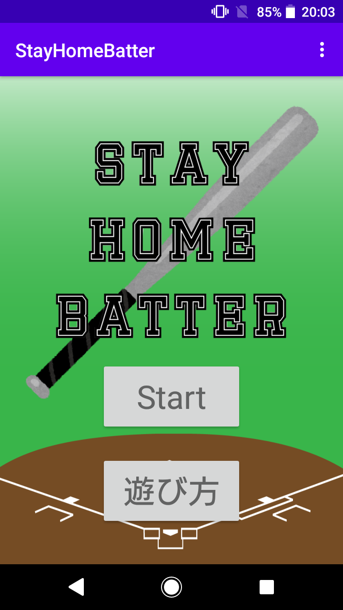
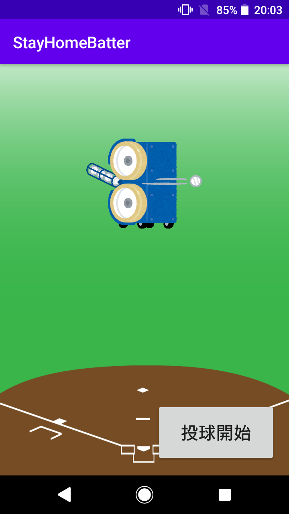
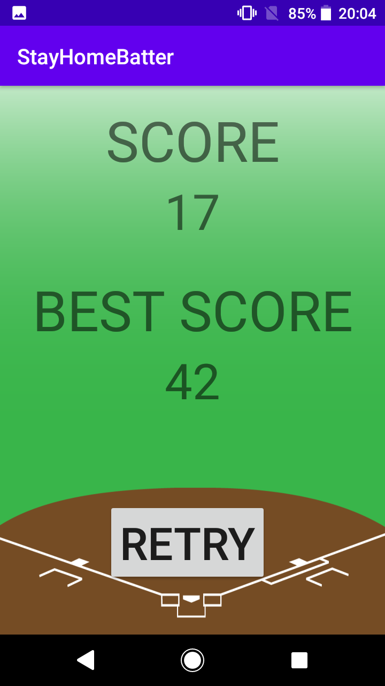

# StayHomeBatter
家にいながらバッティングセンター気分を味わうことができるAndroidアプリです．
端末をバットに見立てたときに，画面をボールに当てる気持ちで遊ぶといい感じに反応します．

## 遊び方

- 上記の"start"を押すとゲームが始まります．


- "投球開始"ボタンを押すとピッチングマシンの音が流れ，スマートフォンをバットに見立てて振るとそのタイミングによって「空振り」，「ノーマルヒット」，「ロングヒット」の３種類の音がなります．


- 10球ワンセットで，10球投げきると上記のリザルト画面が表示されます．
- "RESTART"ボタンでスタート画面に戻ります．

## 使い方
1. このリポジトリを```clone```し，AndroidStudioなどでこのプロジェクトを開きます．
1. このアプリを動かしたいandroid端末で「設定」から「バージョン情報」を連打し，デベロッパーモードにする．
1. 「開発者向けオプション」からUSBデバッグを有効にする．
1. PCとandroid端末をUSBで接続し，AndroidStudio上部のRUNボタン（緑の横向き三角形）を押す．
1. しばらくすると端末にアプリケーションがインストールされるので遊ぶ．