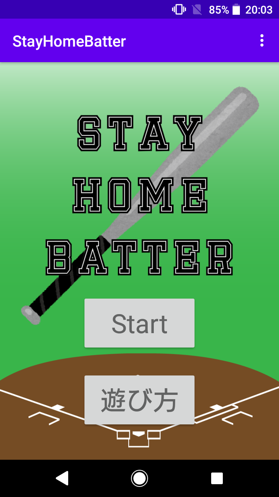
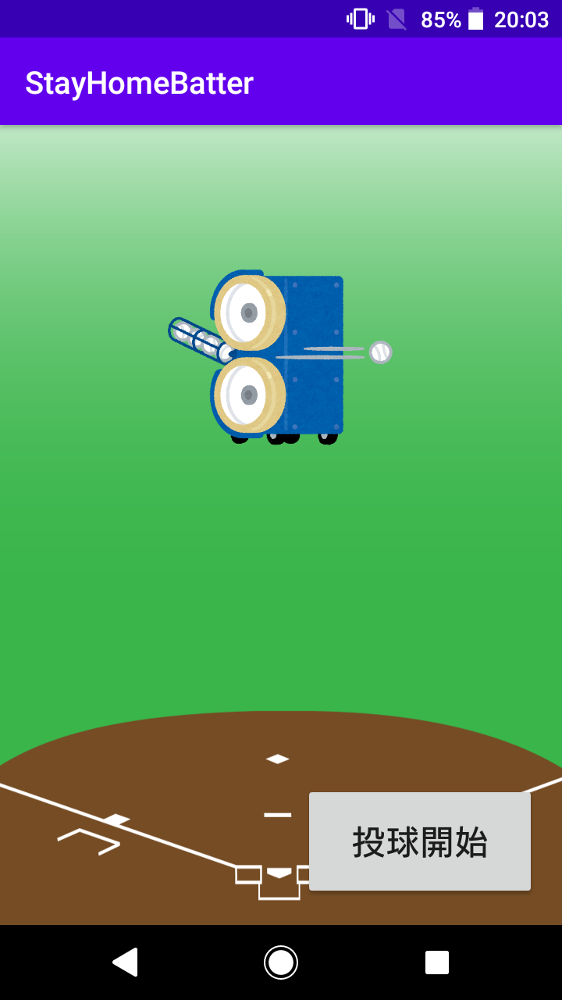
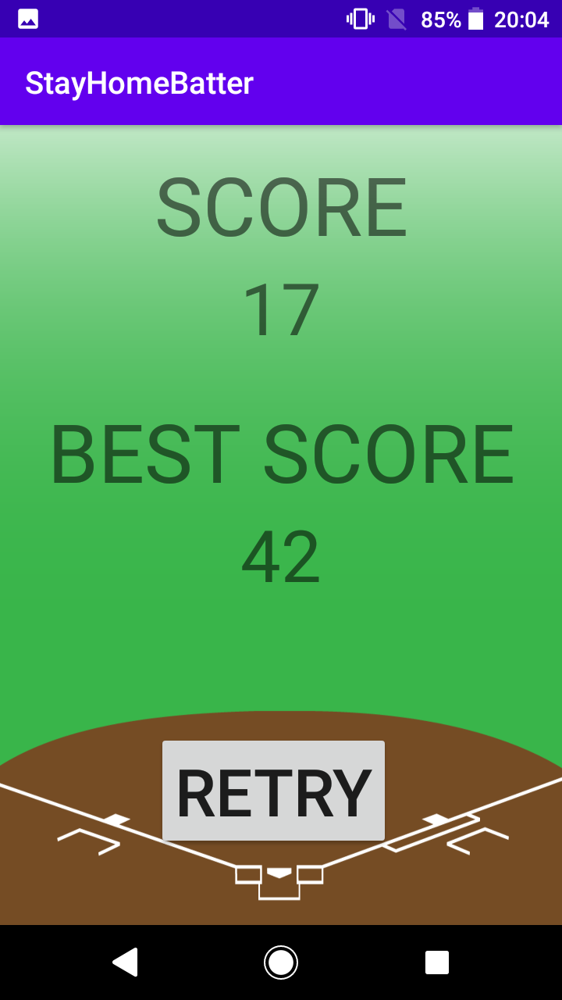

# StayHomeBatter
スマートフォンをバットに見立てて，家にいながらバッティングセンター気分を味わえるAndroidアプリです．
画面をボールに当てるように振るといい感じになります．
実際の動作・プレイ動画は以下のURLからご覧いただけます．
https://youtu.be/hZQBAHr7NjQ

## 遊び方

- スタート画面です．
- 「start」ボタンを押してゲームを開始します．

- ゲーム画面です．
- 「投球開始」ボタンを押すと，ピッチングマシンの音とともにボールが投げられます．
- 投球音が流れたあとに端末をバットのように振ると，そのタイミングによって「空振り」「ノーマルヒット」「ロングヒット」の音が鳴ります．

- リザルト画面です
- 10球ワンセットで，10球の投球が終わるとこの画面に移行します．
- 「RETRY」でもう一度初めから遊べます．

## インストール方法
1. このリポジトリを```clone```し，AndroidStudio等で開きます．
1. インストールしたいAndroid端末の「設定」からビルド番号の項目を連打し(7回連続でタップ)開発者モードをオンにします．
1. 「開発者向けオプション」からUSBデバッグを有効にします．
1. PCと端末をUSBで接続し，AndroidStudio上部の実行ボタン（緑の横向き三角形）を押して，端末へアプリをインストールします．
